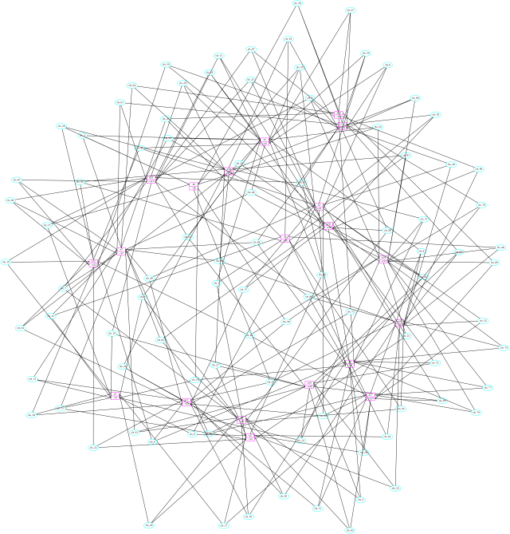

gsat_solve
==========

A simple GSAT-based SAT-solver. Use command-code 3 to load a standard DIMACS-
format CNF file. Solve with command-code 4 (optionally specify number of
tries and number of flips per try). Dump result to screen with command-code
5. Dump to file with command-code 6 (be sure to create work directory first).

Building
--------

This program is dependent on three other libraries in my repository. Here is
a sample build procedure:

    % git clone https://github.com/claytonkb/lib_babel
    % git clone https://github.com/claytonkb/cnf_parse
    % git clone https://github.com/claytonkb/sat_tools
    % git clone https://github.com/claytonkb/gsat_solve
    % cd gsat_solve
    % perl make.pl
    % bin/test

If you want verbosity during the build, provide the -v or -V switch to make.pl.
If you want to write your own Makefile or use another build solution, you can
use the -vt option (verbose, testing-only) to see the shell commands that
make.pl would issue if it were run without the -t switch to aid you in
constructing your own build solution.

Testing
-------

To test the solver, load your CNF file using command-code 3. If you want some
sample CNFs to test the solver with, you can clone my (small) CNF repo:

    % git clone https://github.com/claytonkb/cnf_files

Load, solve and dump the result using the following commands:

    % bin/test
    type 0 for menu
    % 3 <cnf_filename>
    % 4
    st->cl->num_clauses <A>
    tempv <B>
    % 6
    % 2

Now, the work/check.cnf file contains gsat-solve's SAT solution to your CNF.
It is not guaranteed to be correct since GSAT is a probabilistic solver. You
can determine if the solver found a solution by comparing A and B above. If
they are equal, a solution was found. Otherwise B is the maximum number of
clauses the solver was able to satisfy. (NOTE: You can increase the chances the
solver finds a solution by providing #tries and #flips arguments to
command-code 4).

You can easily check the solution using a standard SAT-solver. If you have
cryptominisat installed, for example, you can use it to verify the solution as
follows:

    % cryptominisat5 work/check.cnf

Viewing
-------

You can dump out a loaded CNF to Graphviz format using command-code 7. The file
will be sent to work/cnf_graph.dot. The Graphviz neato tool works well for
converting the dot file to an image format. An example command sequence:

    % bin/test
    type 0 for menu
    % 3 ../cnf_files/uf20.cnf
    % 7
    introspect_sat_gv() ==> work/cnf_graph.dot
    % 2
    exiting
    LIB_BABEL: Done
    % neato -Tsvg work/cnf_graph.dot > work/cnf_graph.svg

Open in your favorite image-viewer.

